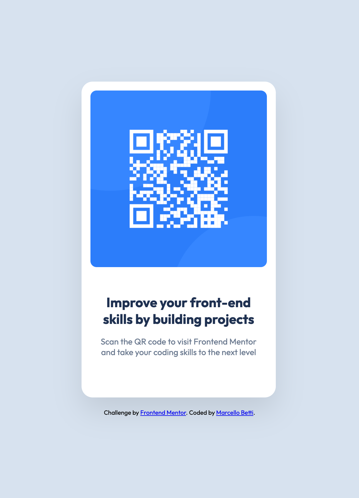

Ecco il tuo `README.md` aggiornato con le ultime correzioni tecniche che abbiamo implementato per risolvere il problema del decentramento e per rendere il codice ancora più professionale.

````markdown
# Frontend Mentor - QR code component solution

This is a solution to the [QR code component challenge on Frontend Mentor](https://www.frontendmentor.io/challenges/qr-code-component-iux_sIO_H). Frontend Mentor challenges help you improve your coding skills by building realistic projects. 

## Table of contents

- [Overview](#overview)
  - [Screenshot](#screenshot)
  - [Links](#links)
- [My process](#my-process)
  - [Built with](#built-with)
  - [What I learned](#what-i-learned)
  - [Continued development](#continued-development)
  - [AI Collaboration](#ai-collaboration)
- [Author](#author)

## Overview

### Screenshot



### Links

- Solution URL: https://github.com/MathCat0000/qr-code-component

- Live Site URL: https://mathcat0000.github.io/qr-code-component/

## My process

### Built with

- Semantic HTML5 markup
- CSS custom properties (Variables)
- Flexbox (Column direction)
- Mobile-first approach
- Google Fonts integration

### What I learned

During this project, I deepened my understanding of CSS variables and the power of `:root` for maintaining consistent themes. 

A major learning point was mastering the Flexbox axis. I initially struggled with centering when adding a footer, but I learned that switching `flex-direction` to `column` requires using `align-items: center` for horizontal alignment. I also fixed a centering issue caused by `position: absolute` by bringing the footer back into the natural document flow.

```css
/* Perfect centering logic for card + footer */
body {
    display: flex;
    flex-direction: column;
    justify-content: center;
    align-items: center;
    min-height: 100vh;
    padding: 20px;
}
````

### Continued development

In future projects, I want to focus on:

  - Advanced CSS Grid for more complex layouts.
  - Refining my responsive design skills using Media Queries.
  - Improving accessibility by using more descriptive ARIA labels.

### AI Collaboration

I worked with an AI mentor (Gemini) to build this project through a guided, step-by-step process.

  - **How I used it:** I used the AI to explain the logic behind CSS properties like `box-shadow` and `max-width`. It helped me debug the "off-center" issue by explaining how `position: absolute` affects the browser's full-page screenshot rendering.
  - **What worked well:** The iterative feedback loop allowed me to catch visual bugs that I might have missed otherwise.
  - **Impact:** I gained a deeper conceptual understanding of the CSS Box Model and Flexbox axes rather than just copying a solution.

## Author

  - Git Hub - [@marcellobetti](https://www.frontendmentor.io/profile/MathCat0000)

<!-- end list -->

```
